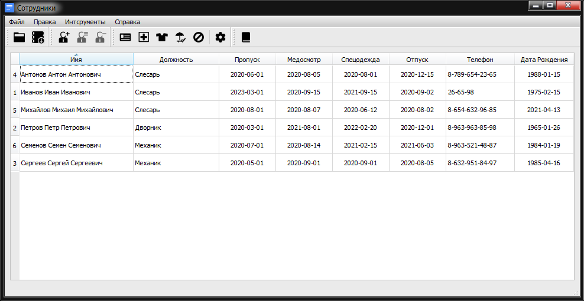

# Staff (Сотрудники)
## Содержание
* Общее описание
* Элементы внешнего вида
* Краткое описание ее реализации

## Общее описание:

 Программа **Staff** позволяет создавать, редактировать и делать копии уже созданых баз данных сотрудников (в виде файла БД sqlite) и служит для контроля таких событий как дата окончания действия пропуска, дата следующего получения спецодежды или прохождения медосмотра и т.п. Отображаются все данные в виде таблицы.

 Для удобства наблюдения предстоящих событий имеется фильтр, который показывает лишь те события, которые произойдут в ближайшее время (период устанавливается в настройках). Имеется сортировка каждого столбца по содержимому от меньшего к большему и наоборот, а также имеется возможность скрывать/ отключать неиспользуемые столбцы и даты событий.

## Внешний вид:

## Структура проекта: (краткое описание ее реализации):
Программа написана на C++ с помощью Qt Фреймворка и ее проект состоит из следующих файлов:

**staff.pro** - профайл;

**main.cpp** - основной исходный файл, с которого стартует приложение;

**mainwindow.h** - заголовочный файл основного окна приложения;

**mainwindow.cpp** - исходный код окна;

**mainwindow.ui** - формочка основного окна приложения;

**database.h** - заголовочный файл вспомогательного класса, применяющегося для работы с информацией, которая помещена в базу данных;

**database.cpp** - исходный файл вспомогательного класса, применяющегося для работы с информацией, которая помещена в базу данных;

**editform.h** - заголовочный файл диалогового окна для добавления и редактирования записей;

**editform.cpp** - исходный файл диалогового окна для добавления и редактирования записей;

**editform.ui** – форма редактора записей;

**filterproxymodel.h** – заголовочный файл вспомогательного класса, применяющегося для фильтрации информации, которая помещена в базу данных;

**filterproxymodel.cpp** – исходный файл вспомогательного класса, применяющегося для фильтрации информации, которая помещена в базу данных;
